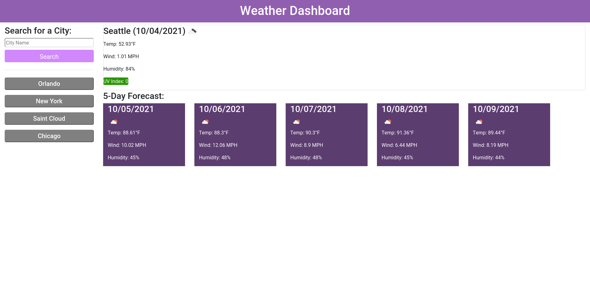

# weather-dashboard

## Weather Dashboard
This was a project to use the "OpenWeather One Call API" to create a weather dashboard that can display current and future forecasts on top of saving previous searches.\
[Here]() you can find the application deployed on GitHub pages.

## Example photo of web appilcation

